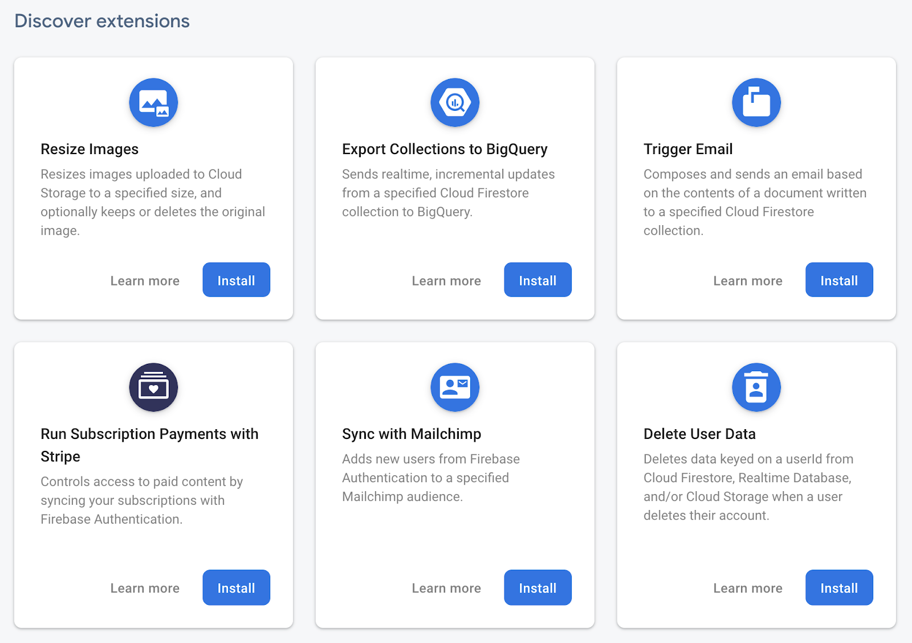

# Add subscription payments to your web app with Firebase Extensions & Stripe

## Introduction

> aside negative
Contributed by the Firebase community. Not official Google documentation.

### Goals

In this codelab, you'll add subscription payment functionality to a web app using Firebase Extensions, Firebase Authentication, Cloud Firestore, and Stripe.


### What you'll build

In this codelab, you'll add the following features to a skeleton web app:

* User signup & login with Firebase authentication.
* Read data from Cloud Firestore and render it to your web page.
* Offer different pricing plans to your customers and create [subscriptions](https://stripe.com/docs/billing/subscriptions/overview) for them with [Stripe Checkout](https://stripe.com/payments/checkout).
* Allow customers to manage their subscriptions and payment methods with the [Stripe customer portal](https://stripe.com/docs/billing/subscriptions/customer-portal).
* Automatically delete user & customer data from Cloud Firestore and Stripe when a user deletes their account.

### What you'll learn

* How to use Firebase Extensions
* How to seamlessly sync data between Stripe and Cloud Firestore without writing any server code
* How to use Firebase Authentication custom claims and Firestore security rules to control access to subscriber-only resources
* How to maintain (monitor, update, and uninstall) extensions in your project

This codelab is focused on Firebase Extensions. For detailed information about other Firebase products mentioned in this codelab, refer to the  [Firebase documentation](https://firebase.google.com/docs) and other  [codelabs](https://codelabs.developers.google.com/?cat=Firebase).

### What you'll need

* A computer with a modern web browser installed (Chrome is recommended)
* A Google account
* A  [Stripe account](https://dashboard.stripe.com/)
* A credit card. Cloud Functions for Firebase requires the Firebase Blaze plan which means you will have to enable billing on your Firebase project using a credit card.
 See the  [Cloud Functions for Firebase billing FAQ](https://firebase.google.com/support/faq#extensions-pricing) for a detailed explanation.


## Create and set up a Firebase project
Duration: 05:00


### Create a Firebase project

1. In the  [Firebase console](https://console.firebase.google.com), click **Add project**, and name the Firebase project **StripeSubscription**.
2. Click though the project creation options. Accept the Firebase terms. Skip setting up Google Analytics, because you won't use Analytics in this app.
3. Wait for the project to be provisioned, and then click **Continue**.

The application that you'll build uses a few Firebase products available for web apps:

* **Firebase Authentication** to easily identify your users
* **Cloud Firestore** to store and sync data in a flexible, scalable NoSQL cloud database

You'll now enable and configure those Firebase products, using the Firebase console.

### Enable email login

When managing recurring payments and access to restricted content, it's crucial to have authentication in your app, to uniquely identify everyone who uses it. You'll use Firebase Authentication's email login.

1. In the Firebase console, click **Authentication** in the left panel.
2. Click the **Sign-in method** tab (or  [click here](https://console.firebase.google.com/project/_/authentication/providers) to go directly to the **Sign-in method** tab).
3. Click **Email/Password** in the **Sign-in providers** list, set the **Enable** switch to the on position, and then click **Save**.


### Create a Cloud Firestore Database

The app uses Cloud Firestore to store product and pricing information, as well as customer details like their Stripe customer ID and subscription.

1. In the Firebase console, click [**Cloud Firestore**](https://console.firebase.google.com/project/_/firestore) in the left panel.
2. Click **Create database**.


3. Select **Start in production mode**, and click **next**. 
4. Select your preferred  [Cloud Firestore location](https://firebase.google.com/docs/firestore/locations) and click **done**.

### Set security rules

Now, you'll set the security rules needed for this app. These are some example rules to help secure your app. These rules allow anyone to view items for product and pricing information, but only allow signed-in users to perform other reads and writes. For example each customer is only able to read **their own** information, checkout session, and subscriptions. Lastly, we have two content collections `content-basic` and `content-premium` which are secured via  [custom claims](https://firebase.google.com/docs/auth/admin/custom-claims). More on that later.

> aside positive
> 
> **Important:** For your apps, especially production apps, it's very important that you secure your Cloud Firestore Database using security rules. Learn more about security rules in the  [Firebase documentation](https://firebase.google.com/docs/rules).

1. At the top of the Cloud Firestore Database dashboard, click the **Rules** tab.


2. Copy and paste the following rule set into the rules field in the **Rules** tab:

```
rules_version = '2';
service cloud.firestore {
  match /databases/{database}/documents {
    function hasBasicSubs() {
      return request.auth.token.stripeRole == "basic";
    }

    function hasPremiumSubs() {
      return request.auth.token.stripeRole == "premium";
    }

    match /content-basic/{doc} {
      allow read: if hasBasicSubs() || hasPremiumSubs(); 
    }
    match /content-premium/{doc} {
      allow read: if hasPremiumSubs(); 
    }

    match /customers/{uid} {
      allow read: if request.auth.uid == uid;

      match /checkout_sessions/{id} {
        allow read, write: if request.auth.uid == uid;
      }
      match /subscriptions/{id} {
        allow read: if request.auth.uid == uid;
      }
    }

    match /products/{id} {
      allow read: if true;
      allow write: if false;

      match /prices/{id} {
        allow read: if true;
        allow write: if false;
      }
    }
  }
}
```

3. Click **Publish**.


## Run the sample app
Duration: 02:00


### **Fork the CodeSandbox project**

In this codelab, you'll use CodeSandbox, an online IDE for web development. CodeSandbox requires no software installation or special account.

CodeSandbox lets you share projects with others. Other people who have your CodeSandbox project URL can see your code and fork your project, but they can't edit your it.

1. Go to this URL for the starting code:  [**https://codesandbox.io/s/github/stripe-samples/firebase-subscription-payments/tree/codelabs**](https://codesandbox.io/s/github/stripe-samples/firebase-subscription-payments/tree/codelabs).
2. At the top right of the CodeSandbox page, click **Fork**.


You will see the URL change to your own project URL. If you don't have a CodeSandbox account you will see the "Anonymous" prefix in your project name, but that's OK. The project has a unique name, along with a unique URL. All of your files and changes are saved in this CodeSandbox project.

### **Add a Firebase Web App to the project**

1. In CodeSandbox, view your `public/javascript/app.js` file. This is where you'll add the Firebase configuration object.
2. Back in the Firebase console, navigate to your project's overview page by clicking  [**Project Overview**](https://console.firebase.google.com/project/_/overview) in the top left.
3. In the center of your project's overview page, click the web icon   to create a new Firebase Web App.

4. Register the app with the nickname **StripeSubscription Codelab**. 
5. For this codelab, ***don't*** check the box next to **Also set up Firebase Hosting for this app**. You're going to use the CodeSandbox preview pane instead.
6. Click **Register app**.
7. Copy your app's Firebase configuration object to your clipboard. Don't copy the `&lt;script&gt;` tags. Note: If you need to find the configuration later, follow the instructions  [here](https://support.google.com/firebase/answer/7015592#web).


8. Click **Continue to console**.

Add your project's configuration to your app:

1. Back in CodeSandbox, go to the `public/javascript/app.js` file.
2. Paste your configuration snippet in the file. After you do, it should look like this (but with your own project's values in the configuration object):


### **Set your Stripe publishable key**

To redirect to Stripe Checkout from your web app you will need to set your Stripe publishable key. 

1. Head over to  [https://dashboard.stripe.com/test/apikeys](https://dashboard.stripe.com/test/apikeys).
2. Log in to your Stripe account, or sign up a new account.
3. Copy the publishable key token (pk_test_xxx) and set it for STRIPE_PUBLISHABLE_KEY in your CodeSandbox project.

### What's the starting point for this app?

Take a look at the interactive preview on the right side of the CodeSandbox project:


This codelab starts you off with the code for a login-protected product page. Should you see **"Loading ..."** instead of the **"Sign in with email"** widget, click the refresh button in the preview pane.

When you sign in (you can use a fake email address, name, and password) you won't see any product and pricing information yet, only a "Sign out" button. That's because you will first need to **install and configure** the "Run Subscription Payments with Stripe" extension and **create your products and prices** in the Stripe dashboard.


## Install the "Run Subscription Payments with Stripe" extension
Duration: 06:00


Engineers at Stripe and Firebase have teamed up to build a best-practices subscription payments integration that you can leverage for your web app via a Firebase Extension.

In the Firebase console, click "Extensions" to see a collection of available Firebase Extensions. 

### **Install the extension**

> aside positive
Optional: click **"Learn more"** to see all details as well as instructions to install the extension via the Firebase CLI instead.

1. Click the **"Install"** button.
2. Review the Cloud Functions that the extension will set up for you. These functions take care of the communication with the Stripe API and keep things in sync between your Stripe account and your Cloud Firestore.
3. Next, you will need to enable billing in order for Cloud Functions to be able to communicate with the Stripe API.
4. Review access granted to the extension. This is needed for the extension to manage custom claims for your users and access and update data in Cloud Firestore.

#### Configure the extension

1. Select your preferred region. This should be the same region you selected when you set up your Cloud Firestore Database earlier.
2. Keep the defaults for products and customer collection paths.

#### **Create a restricted key**

3. Navigate to  [https://dashboard.stripe.com/test/apikeys](https://dashboard.stripe.com/test/apikeys) and click "Create restricted key"
4. Set a key name, e.g. "Firebase"
5. In the permissions column, set the following permissions:

* Customers: **Write**
* Checkout Sessions: **Write**
* Customer portal: **Write**
* Subscriptions: **Read**
* Scroll to the bottom and click "**Create key".**

6. In the restricted keys section, click "Reveal test key token" for the firebase key you just created. 
7. Copy the key (`rk_test_xxx`) and paste it into the Firebase console

8. Leave the webhook secret set to FILL_IN_FROM_POSTINSTALL. We will reconfigure that after installation.

### **Configure synchronization between Stripe and Firebase**

While you're waiting for the extension to install, check that you've [set up an account name](https://dashboard.stripe.com/settings/account/?support_details=true) on the Stripe Dashboard.

Once the installation is complete, click "Manage" and select "How this extension works". Follow the steps there starting from **"Configure Stripe webhooks"**. When you get to **"Using the extension"**, come back to the CodeLab here.

If everything is set up correctly, you will see the product and pricing information that you created from your Stripe Dashboard show up in Cloud Firestore. In the Firebase console navigate to **Cloud Firestore** and see the products collection.


Now that the data is available in Cloud Firestore, we can read it with the  [Firebase JavaScript client SDK](https://firebase.google.com/docs/database/web/read-and-write).


## Use the extension in your web app


### Read product and pricing data and render it to the page 

Navigate back to your CodeSandbox project and let's update the app so that it fetches the product and pricing data and renders it to the page.

1. In CodeSandbox, open the `public/javascript/app.js` file.
2. Add the following code below the "Data listeners" comment.

```js
/**
 * Data listeners
 */
function startDataListeners() {
  // Get all our products and render them to the page
  const products = document.querySelector(".products");
  const template = document.querySelector("#product");
  db.collection("products")
    .where("active", "==", true)
    .get()
    .then(function (querySnapshot) {
      querySnapshot.forEach(async function (doc) {
        const priceSnap = await doc.ref
          .collection("prices")
          .orderBy("unit_amount")
          .get();
        if (!"content" in document.createElement("template")) {
          console.error("Your browser doesn't support HTML template elements.");
          return;
        }

        const product = doc.data();
        const container = template.content.cloneNode(true);

        container.querySelector("h2").innerText = product.name.toUpperCase();
        container.querySelector(".description").innerText =
          product.description.toUpperCase() || "";
        // Prices dropdown
        priceSnap.docs.forEach((doc) => {
          const priceId = doc.id;
          const priceData = doc.data();
          const content = document.createTextNode(
            `${new Intl.NumberFormat("en-US", {
              style: "currency",
              currency: priceData.currency
            }).format((priceData.unit_amount / 100).toFixed(2))} per ${
              priceData.interval
            }`
          );
          const option = document.createElement("option");
          option.value = priceId;
          option.appendChild(content);
          container.querySelector("#price").appendChild(option);
        });

        if (product.images.length) {
          const img = container.querySelector("img");
          img.src = product.images[0];
          img.alt = product.name;
        }

        const form = container.querySelector("form");
        form.addEventListener("submit", subscribe);

        products.appendChild(container);
      });
    });
}
```

### Create a subscription for your customer

To create a subscription for your customer, you first need to create a Checkout Session, which is the programmatic representation of what your customer sees when they’re redirected to the payment form. The extension listens to documents being created in the `checkout_sessions` sub-collection and then creates the checkout session for you.

In your `app.js` below the "Event listeners" comment block add the following code.

```js
/**
 * Event listeners
 */

// Signout button
document
  .getElementById("signout")
  .addEventListener("click", () => firebase.auth().signOut());

// Checkout handler
async function subscribe(event) {
  event.preventDefault();
  document.querySelectorAll('button').forEach((b) => (b.disabled = true));
  const formData = new FormData(event.target);

  const docRef = await db
    .collection("customers")
    .doc(currentUser)
    .collection("checkout_sessions")
    .add({
      price: formData.get("price"),
      allow_promotion_codes: true,
      success_url: window.location.origin,
      cancel_url: window.location.origin
    });

  // Wait for the CheckoutSession to get attached by the extension
  docRef.onSnapshot((snap) => {
    const { sessionId } = snap.data();
    if (sessionId) {
      // We have a session, let's redirect to Checkout
      const stripe = Stripe(STRIPE_PUBLISHABLE_KEY);
      stripe.redirectToCheckout({ sessionId });
    }
  });
}
```

### **Show the active subscription once created**

When the customer has successfully signed up for the subscription we want to show them which pricing plan they are subscribed to.

In your `app.js` extend your `startDataListeners` function with the following:

```js
/**
 * Data listeners
 */
function startDataListeners() {
  // Get all our products and render them to the page
  const products = document.querySelector(".products");
  const template = document.querySelector("#product");
// [...] add below your existing code
  // Get all active or trialing subscriptions for the customer
  db.collection("customers")
    .doc(currentUser)
    .collection("subscriptions")
    .where("status", "in", ["trialing", "active"])
    .onSnapshot(async (snapshot) => {
      if (snapshot.empty) {
        // Show products
        document.querySelector("#subscribe").style.display = "block";
        return;
      }
      document.querySelector("#subscribe").style.display = "none";
      document.querySelector("#my-subscription").style.display = "block";
      // In this implementation we only expect one Subscription to exist
      const subscription = snapshot.docs[0].data();
      const priceData = (await subscription.price.get()).data();
      document.querySelector(
        "#my-subscription p"
      ).textContent = `You are paying ${new Intl.NumberFormat("en-US", {
        style: "currency",
        currency: priceData.currency
      }).format((priceData.unit_amount / 100).toFixed(2))} per ${
        priceData.interval
      }`;
    });
}
```

### **Test it out**

In order for the redirect to Checkout to work you will need to open the preview pane in a new window: 

1. In the new window/tab select your product & pricing and click the subscribe button.
2. Wait for the redirect to Stripe Checkout (Note: this can take a couple of seconds for the first execution as Firebase needs to spin up your Cloud Functions).
3. On the Stripe Checkout page, pay with the test card number 4242424242424242, any future data, and any three digits for the CVC. Or select the Google Pay option. 
4. Wait for the redirect back to your web app and see your active subscription in the "My Subscription" section: 

#### **What is happening behind the scenes?**

When your customer completes the checkout form with their payment details and therefore starts an active subscription or trial, Stripe sends a webhook event to one of your Cloud Functions that the extension set up. 

The extension automatically processes the webhook event to retrieve the new subscription status and updates it in your Cloud Firestore. Additionally, if you set a `firebaseRole` in your product metadata in Stripe, the extension will set the corresponding `stripeRole` as a custom claim to your user which you can use to control access to restricted content for example.

Thanks to the webhook channel via Cloud Functions, Stripe can always update your application about changes. For example if a customer's card gets canceled and Stripe can't create a successful payment, the change is synced with your Cloud Firestore and the custom claim role will be removed from the user.

### **Access the Stripe customer portal**

In order for your customers to manage their subscriptions and payment methods send them to the Stripe customer portal.

> aside positive
Learn more about the Stripe customer portal [here](https://stripe.com/docs/billing/subscriptions/customer-portal).

In your `app.js` below your "Checkout handler" add the following code. Make sure to change the `functionLocation` variable to the location to the region you selected when installing the extension.

```js
// Billing portal handler
const functionLocation = "TODO"; // us-central1, for example
document
  .querySelector("#billing-portal-button")
  .addEventListener("click", async (event) => {
    document.querySelectorAll('button').forEach((b) => (b.disabled = true));

    // Call billing portal function
    const functionRef = firebase
      .app()
      .functions(functionLocation)
      .httpsCallable("ext-firestore-stripe-subscriptions-createPortalLink");
    const { data } = await functionRef({ returnUrl: window.location.origin });
    window.location.assign(data.url);
  });
```


## Automatically delete customer & user data
Duration: 06:00

> aside negative
Deleting a user in Firebase will immediately cancel all their active subscriptions and delete their customer object and payment method data in Stripe. Proceed with caution!

### **The problem**

Your customer support team has contacted you again. Sellers who deleted their accounts are still getting emails from other users, and they're angry! These sellers expected that their email addresses would be deleted from your systems when they deleted their accounts. 

For now, support has been manually deleting each user's data, but there has to be a better way! You think about it, and you consider writing your own batch job that runs periodically and clears out email addresses from deleted accounts. But deleting user data seems like a pretty common problem. Maybe Firebase Extensions can help solve this problem, too.

### **The solution**

You'll configure the  [Delete User Data](https://firebase.google.com/products/extensions/user-data-deletion/) extension to automatically delete the `users/uid` node in the database when a user deletes their account.

1. Click the **Install** button on the  [extension's details page](https://firebase.google.com/products/extensions/user-data-deletion/).
2. Choose the Firebase project that you're using for your marketplace web app.
3. Follow the on-screen instructions until you reach the **Configure extension** step.
4. For **Cloud Firestore paths**, enter `customers/{UID}`. The `customers` part is the node whose children contain user email addresses, and `{UID}` is a wildcard. With this configuration, the extension will know that when the user with the UID of 1234 deletes their account, the extension should delete `customers/1234` from the database.
5. Click **Install extension**.

### **While you're waiting for the installation to complete...**

#### **Let's talk about customizability**

In this codelab, you've seen that Firebase Extensions can help solve common use cases and that extensions are configurable to fit your app's needs.

However, extensions can't solve every problem, and the issue of user data deletion is a good example of that. Though the Delete User Data extension addresses the current complaint that emails are still exposed after a user deletes their account, the extension won't delete everything. For example, the item listing is still available, and any images in Cloud Storage will stick around, too. The Delete User Data extension does allow us to configure a Cloud Storage path to delete, but since users can upload many different files with lots of different names, you won't be able to configure this extension to automatically delete these artifacts. For situations like this,  [Cloud Functions for Firebase](https://firebase.google.com/docs/functions) might be a better fit so that you can write code that is specific to your app's data model.

### **See it in action**

After the installation of your extension is complete, delete a user and see what happens:

1. In the Firebase console, head over to your  [**Cloud Firestore dashboard**](https://console.firebase.google.com/u/0/project/_/database/firestore).
2. Expand the `customers` node.
3. Each customer's information is keyed on their user UID. Pick a user's UID.
4. In the Firebase console, head over to your  [**Authentication** dashboard](https://console.firebase.google.com/u/0/project/_/authentication/users), and find that user UID.
5. Expand the menu to the right of the UID, and select **Delete Account**.


6. Go back to your **Cloud Firestore Database** dashboard. The seller's information will be gone!

> aside positive
> 
> **Note:** You deleted this user through the Firebase console, but this extension also works if a user is deleted with a  [client library](https://firebase.google.com/docs/auth/web/manage-users#delete_a_user) or the  [Admin SDK](https://firebase.google.com/docs/auth/admin/manage-users#delete_a_user).


## Congratulations!


Even though you didn't write much code in this codelab, you added important features to your marketplace app.

You learned how to discover, configure, install, and reconfigure extensions. In addition, you learned about how to monitor installed extensions and how to uninstall them, if necessary.

### **What's next?**

Check out some of these other extensions:

*  [Send invoices using Stripe](https://firebase.google.com/products/extensions/firestore-stripe-invoices)
*  [Translate text strings in Cloud Firestore](https://firebase.google.com/products/extensions/firestore-google-translate/)
*  [Add new users to Mailchimp email lists](https://firebase.google.com/products/extensions/mailchimper/)
*  [Shorten URLs](https://firebase.google.com/products/extensions/firestore-shorten-urls-bitly/)

### Need more custom server-side code?

*  [Check out the Cloud Functions for Firebase codelab](https://codelabs.developers.google.com/codelabs/firebase-cloud-functions/#0)
*  [Create Stripe customers and charge them on Firestore write](https://github.com/firebase/functions-samples/tree/master/stripe)
*  [Firebase mobile payments: Android & iOS with Cloud Functions for Firebase](https://github.com/stripe-samples/firebase-mobile-payments)

### Learn more about Stripe

* [Subscribe to the Stripe developers YouTube channel](https://www.youtube.com/stripedevelopers)
* [Stay updated with the Stripe developer digest](https://go.stripe.global/dev-digest)
* [Browse the Stripe samples](https://github.com/stripe-samples/) 

### **Other helpful documents**

**Managing extensions:**

*  [Try managing extensions with the Firebase CLI](https://firebase.google.com/docs/extensions/manage-installed-extensions?platform=cli)
*  [Set budget alerts](https://firebase.google.com/docs/extensions/manage-installed-extensions?platform=console#set-budget-alerts)
*  [Check how often an installed extension is running](https://firebase.google.com/docs/extensions/manage-installed-extensions?platform=console#check-how-often-running)
*  [Update an installed extension to a new version](https://firebase.google.com/docs/extensions/manage-installed-extensions?platform=console#update-version)
*  [Uninstall an extension](https://firebase.google.com/docs/extensions/manage-installed-extensions?platform=console#uninstall)

**Learning the finer details about extensions:**

* View the source code and docs for the Stripe extensions  [on GitHub](https://github.com/stripe/stripe-firebase-extensions)
* Learn about the  [permissions and access](https://firebase.google.com/docs/extensions/permissions-granted-to-extension) granted to an extension
